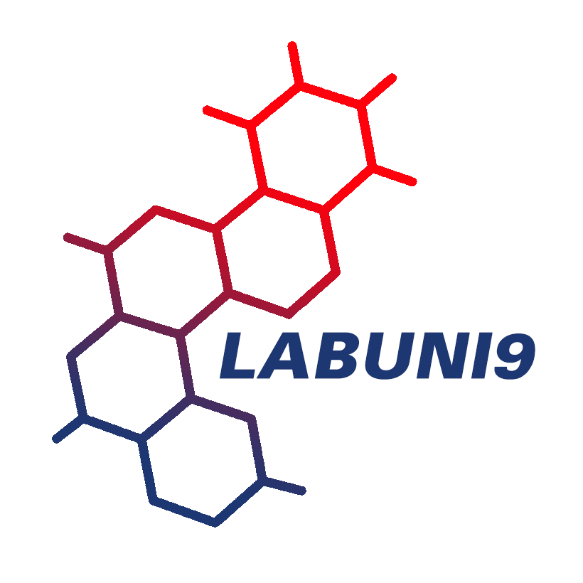
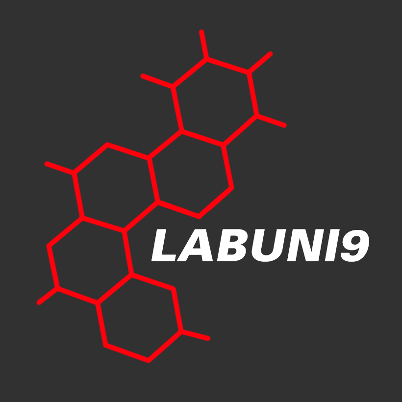

# LabCidades Logos

Logos do LabCidades em versão `light` e `dark` com/sem fundo transparente.

   

## License

Os logos do LabCidades estão licenciados com uma licença [Creative Commons Atribuição-CompartilhaIgual 4.0 Internacional](http://creativecommons.org/licenses/by-sa/4.0/).

